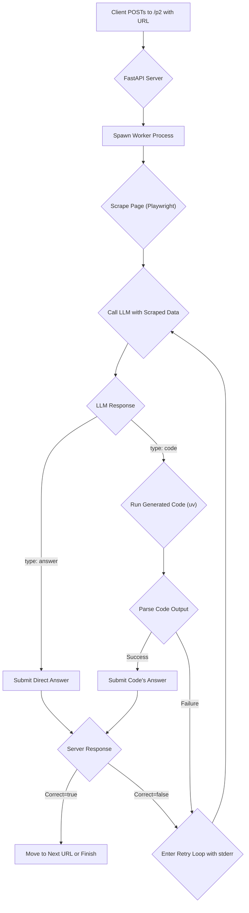

# Autonomous Data Extraction Agent for Web Challenges

This project implements a sophisticated, autonomous agent designed to solve data extraction and reasoning challenges presented on web pages. The system can analyze a web page, identify a question, formulate a solution (either directly or by generating Python code), and submit the answer to a specified endpoint.

It is built to be robust, featuring self-correction, timeouts, and a detailed retry mechanism to handle complex, multi-step problems and transient failures.

## Table of Contents

- [Overview](#overview)
- [Core Components](#core-components)
- [Workflow](#workflow)
- [Features](#features)
- [Setup and Installation](#setup-and-installation)
- [Usage](#usage)
- [Configuration](#configuration)

## Overview

The agent operates by receiving an initial URL. It then performs the following high-level steps:

1.  **Scrape & Analyze**: It uses Playwright to render the target URL, executing JavaScript to get the final state of the page. It extracts HTML content, visible text, and takes a screenshot for contextual analysis.
2.  **Reason & Solve**: The extracted data is sent to a Gemini-powered LLM, which acts as the core reasoning engine. Guided by a detailed system prompt (`system-instruction1.txt`), the LLM either provides a direct answer or generates a Python script to solve the problem.
3.  **Execute & Verify**: If code is generated, the system runs it in a sandboxed environment using `uv`. The script's output is captured to get the final answer.
4.  **Submit & Correct**: The answer is submitted to the submission URL found on the page. If the answer is incorrect, the agent enters a retry loop, feeding diagnostic information (server response, error logs) back to the LLM to self-correct.

This entire process is managed within a strict time budget to ensure efficiency.

## Core Components

1.  **FastAPI Server (`main_fixed.py`)**:
    - The main entry point of the application, providing a `/p2` endpoint to initiate tasks.
    - Manages the overall workflow, including timing, retries, and orchestration of other components.
    - Spawns worker processes to handle long-running tasks without blocking the server.

2.  **Scraper Module (Playwright)**:
    - Navigates to web pages and waits for dynamic content to load.
    - Extracts text, HTML, and screenshots.
    - Includes heuristics to automatically discover submission URLs from forms, links, and `data-` attributes.

3.  **LLM Agent (Gemini)**:
    - The "brain" of the operation, powered by Google's Gemini models.
    - Receives context (text, HTML, screenshot, diagnostics) and decides on a course of action.
    - Its behavior is strictly defined by the rules and heuristics in `system-instruction1.txt`.

4.  **Code Executor (`uv`)**:
    - Safely executes LLM-generated Python code.
    - Manages dependencies specified in the generated script's header.
    - Captures `stdout` and `stderr` for answer extraction and error diagnosis.

5.  **System Instructions (`system-instruction1.txt`)**:
    - A comprehensive prompt that defines the agent's role, capabilities, and constraints.
    - Contains detailed heuristics for handling various data types (PDF, CSV, JSON, images) and scenarios, ensuring consistent and reliable behavior.

## Workflow



## Features

- **Autonomous Operation**: Fully automated from question discovery to submission.
- **Dynamic Content Handling**: Uses Playwright to handle modern, JavaScript-heavy websites.
- **Multi-Modal Analysis**: Leverages text, HTML, and screenshots to understand the task.
- **Code Generation**: Solves complex computational or data-processing tasks by writing and executing its own Python scripts.
- **Self-Correction**: Uses feedback from failed attempts to refine its approach.
- **Robust Error Handling**: Manages timeouts, execution errors, and submission failures gracefully.
- **Secure**: Uses constant-time secret comparison and basic SSRF protection.

## Setup and Installation

1.  **Clone the repository:**
    ```bash
    git clone <your-repo-url>
    cd Projrct-2
    ```

2.  **Create a `.env` file** in the root directory and add your credentials:
    ```env
    EMAIL="your-email@example.com"
    SECRET="your_shared_secret_key"
    GEMINI_API_KEY="your_google_ai_studio_api_key"
    ```

3.  **Install dependencies:** The project uses `uv` for package management.
    ```bash
    pip install uv
    uv pip install -r requirements.txt
    ```

4.  **Install Playwright browsers:**
    ```bash
    playwright install
    ```

## Usage

1.  **Run the FastAPI server:**
    ```bash
    uvicorn main_fixed:app --host 0.0.0.0 --port 8000
    ```

2.  **Send a POST request** to the `/p2` endpoint to start a task:
    ```bash
    curl -X POST http://localhost:8000/p2 \
    -H "Content-Type: application/json" \
    -d '{
      "email": "your-email@example.com",
      "secret": "your_shared_secret_key",
      "url": "http://challenge-url.com/start"
    }'
    ```
    The server will respond immediately with a `200 OK` and process the task in the background. Check the server logs for real-time progress.

## Configuration

The following constants can be adjusted in `main_fixed.py` to tune performance:

- `JOB_TIMEOUT_SEC`: Total time budget for a single question (default: 180s).
- `RETRY_MARGIN_SEC`: Time threshold below which retries are limited (default: 50s).
- `SAFETY_MARGIN_SEC`: Time threshold to stop all work on a question (default: 5s).
- `MAX_EXEC_TIMEOUT_SEC`: Maximum execution time for an LLM-generated script (default: 30s).


